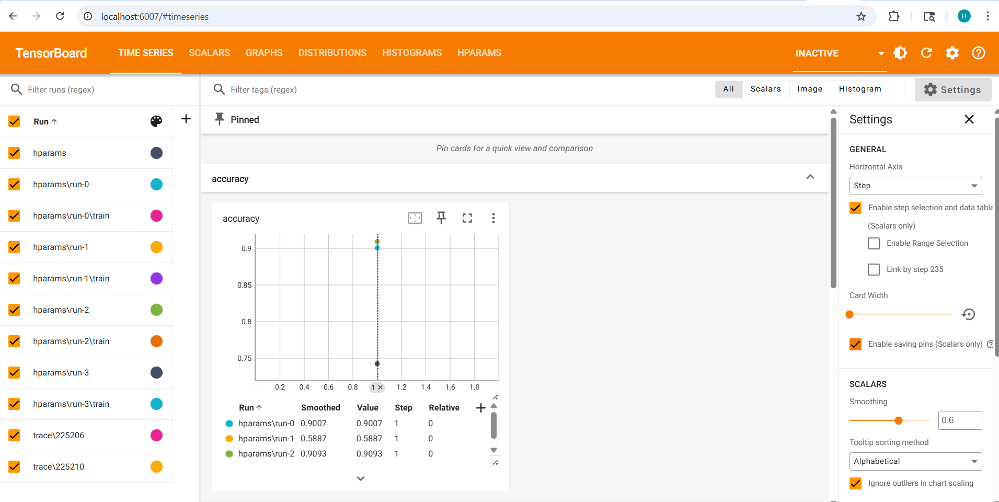

# MNIST Embeddings and TensorBoard Lab

## Overview

This project demonstrates the use of TensorFlow, Keras, and TensorBoard for:

1. Training a simple neural network on the MNIST dataset.
2. Extracting embeddings from an intermediate layer.
3. Visualizing embeddings using TensorBoard Projector.
4. Tracing a custom TensorFlow function for profiling.

The goal is to explore model introspection, embedding visualization, and profiling in a machine learning workflow.

## Environment Setup

It is recommended to use a Python virtual environment to avoid version conflicts.

```
# Create a virtual environment
python -m venv tf_env

# Activate the environment (Windows)
tf_env\Scripts\activate

# Install required packages
pip install tensorflow tensorboard jupyter numpy
```

Notes:

* Python 3.12 or higher may require TensorFlow >=2.16 due to compatibility.
* Start the notebook with this environment active.

## Dataset

The MNIST dataset of handwritten digits is used:

* 28x28 grayscale images
* 10 classes (digits 0-9)
* Training subset is used for embedding extraction

## Model Architecture

I use Keras Functional API to define a simple model:

```python
from tensorflow import keras

inputs = keras.Input(shape=(28, 28), name="input_layer")
x = keras.layers.Flatten()(inputs)
x = keras.layers.Dense(16, activation='relu', name="embed_layer")(x)
outputs = keras.layers.Dense(10, activation='softmax')(x)

model = keras.Model(inputs=inputs, outputs=outputs, name="mnist_model")
model.compile(optimizer='adam', loss='sparse_categorical_crossentropy', metrics=['accuracy'])
```

Explanation:

* Flatten converts 2D images to 1D vectors.
* Dense layer with relu activation generates embeddings (embed_layer).
* Final Dense layer with softmax outputs class probabilities.

## Embedding Extraction

Create a new model that outputs the intermediate layer for embedding extraction:

```python
embed_model = keras.Model(inputs=model.input, outputs=model.get_layer("embed_layer").output)
sample_img = x_train[:50]
sample_lbl = y_train[:50]
embeddings = embed_model.predict(sample_img)
```

## Saving Embeddings for TensorBoard Projector

TensorBoard Projector requires embeddings and corresponding metadata.

```python
import numpy as np
import os
from datetime import datetime
from tensorboard.plugins import projector

embed_dir = f"logs/embeddings/{datetime.now().strftime('%H%M%S')}"
os.makedirs(embed_dir, exist_ok=True)

# Save embeddings and metadata
np.savetxt(os.path.join(embed_dir, 'embeddings.tsv'), embeddings, delimiter='\t')
np.savetxt(os.path.join(embed_dir, 'metadata.tsv'), sample_lbl, fmt='%d')

# Configure TensorBoard Projector
config = projector.ProjectorConfig()
embedding = config.embeddings.add()
embedding.tensor_name = 'embedding_tensor'
embedding.metadata_path = 'metadata.tsv'

projector.visualize_embeddings(embed_dir, config)
```

Explanation:

* Each row in embeddings.tsv corresponds to an image.
* metadata.tsv contains labels for coloring points in the projector.
* visualize_embeddings generates a projector configuration for TensorBoard.

## TensorBoard Usage

### Launch TensorBoard

```python
%load_ext tensorboard
%tensorboard --logdir logs --port 6007
```

Notes:

* If TensorBoard reports "Reusing TensorBoard on port...", restart the Jupyter kernel to clear old sessions.
* Alternatively, launch TensorBoard from the terminal:

```
tensorboard --logdir logs --port 6007
```

Open your browser at `http://localhost:6007`.

## Profiling a Custom Function

You can trace and profile any TensorFlow function:

```python
from datetime import datetime
import tensorflow as tf

@tf.function
def custom_fn(x):
    return tf.nn.relu(x * 2)

trace_dir = f"logs/trace/{datetime.now().strftime('%H%M%S')}"
writer = tf.summary.create_file_writer(trace_dir)

# Start tracing
tf.summary.trace_on(graph=True, profiler=True, profiler_outdir=trace_dir)
_ = custom_fn(tf.ones((3,3)))

# Export trace
with writer.as_default():
    tf.summary.trace_export(name="custom_fn_trace", step=0)
```

Notes:

* This allows visualization of the graph and execution profile.
* Warnings about "No profiler is running" are not critical if only the graph is needed.

## Key Takeaways

* Use Functional API for flexible models and access to intermediate layers.
* TensorBoard can visualize embeddings and profiling traces.
* Call the model at least once (`model(x)`) before extracting embeddings to initialize input/output tensors.
* Virtual environments prevent version conflicts between TensorFlow, Keras, and Python.

## References

* [TensorFlow Documentation](https://www.tensorflow.org/)
* [TensorBoard Projector](https://www.tensorflow.org/tensorboard/tensorboard_projector_plugin)
* [MNIST Dataset](http://yann.lecun.com/exdb/mnist/)
