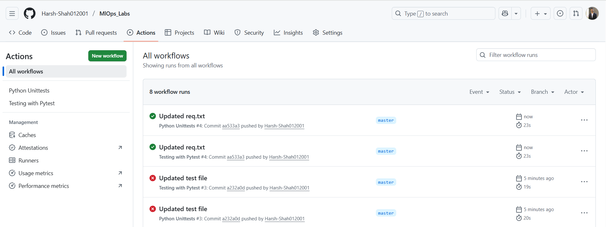

# Temperature Converter - MLOps Lab

A simple Python project demonstrating automated testing and CI/CD with GitHub Actions.

## Features
- Convert between Celsius, Fahrenheit, and Kelvin
- Automated testing with Pytest and Unittest
- GitHub Actions CI/CD pipeline

## Setup Instructions

### 1. Create Virtual Environment
```bash
python -m venv venv
source venv/bin/activate  # On Windows: venv\Scripts\activate
```

### 2. Install Dependencies
```bash
pip install pytest
pip freeze > requirements.txt
```

### 3. GitHub Repository Setup
1. Create a new repository on GitHub
2. Clone the repository locally:
   ```bash
   git clone <your-repo-url>
   cd <your-repo-name>
   ```

### 4. Create Folder Structure
```bash
mkdir src test .github .github/workflows
```

### 5. Add Files
- Place `temperature.py` in `src/` folder
- Place test files in `test/` folder
- Place workflow files in `.github/workflows/` folder
- Create `.gitignore` and add `venv/` to it

### 6. Push to GitHub
```bash
git add .
git commit -m "Initial commit with temperature converter"
git push origin main
```

## Running Tests Locally

### Using Pytest
```bash
pytest test/test_pytest.py
```

### Using Unittest
```bash
python -m unittest test.test_unittest
```

## GitHub Actions
Once pushed to GitHub, the workflows will automatically:
- Run tests on every push to main branch
- Generate test reports
- Notify on success/failure

## Functions Available
- `celsius_to_fahrenheit(celsius)` - Convert °C to °F
- `fahrenheit_to_celsius(fahrenheit)` - Convert °F to °C
- `celsius_to_kelvin(celsius)` - Convert °C to K
- `kelvin_to_celsius(kelvin)` - Convert K to °C
